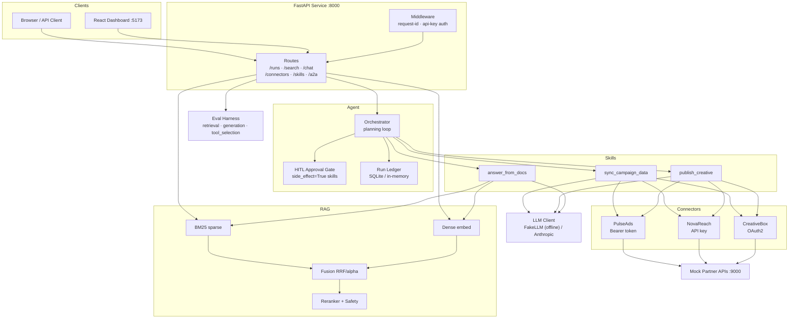
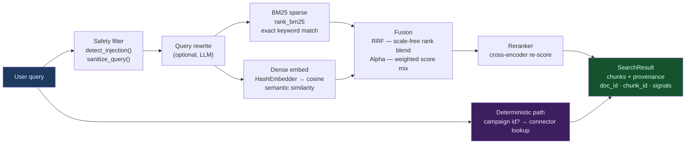
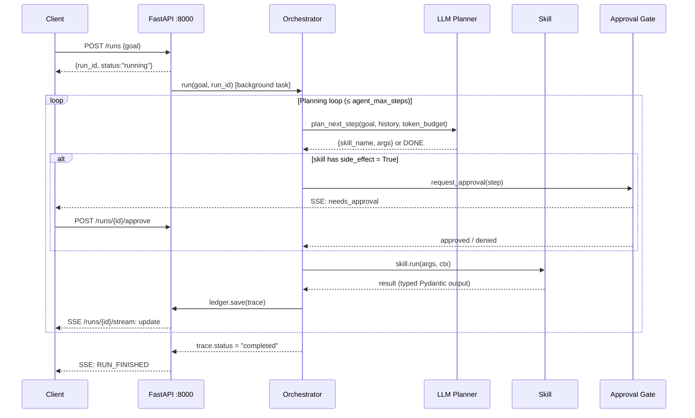
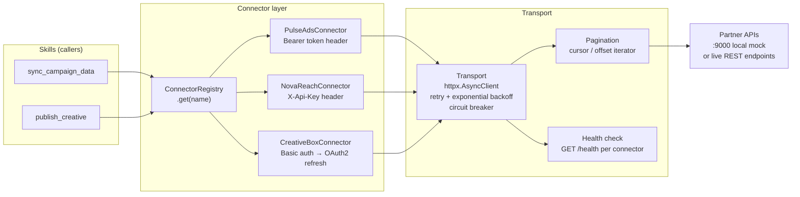
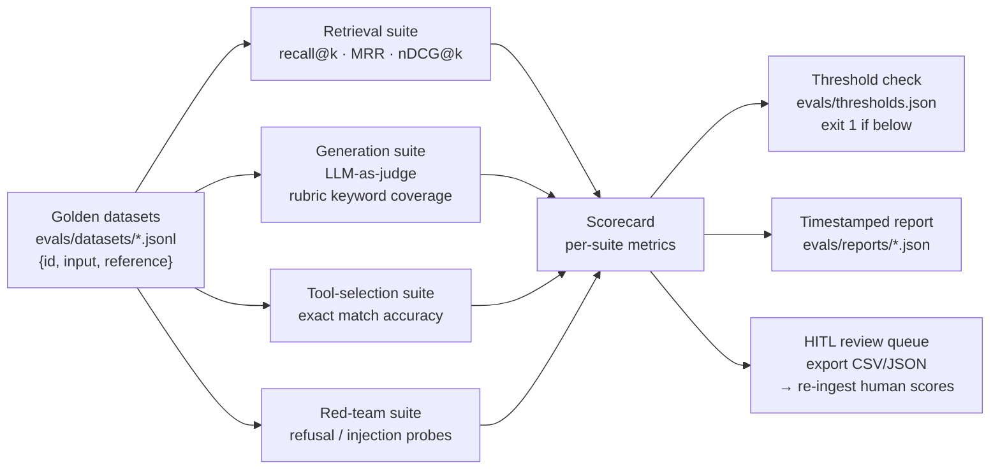

# AI Integration Sandbox (`aih`)

An **offline-first, AI-native integration hub** covering two engineering profiles:

- **Product AI Engineering** (API & Integrations): Spec-Driven Development, AI Skills,
  Evals, RAG, human-in-the-loop + agentic workflows, MCP, end-to-end ownership.
- **Integration Engineering** (ad-tech): Python automations, REST GET/PUSH across
  ad networks, LLM + MCP inside the flow, a React/TS monitoring UI, AWS deploy, architecture +
  challenge-back.

It runs with **no external accounts or API keys by default**: the LLM is a deterministic `FakeLLM`,
embeddings use a deterministic `HashEmbedder`, and every external REST API is a local FastAPI fake in
`mock_apis/`. So `python tasks.py test` is fully offline and deterministic.

**Interview practice guide (HTML):** open [`docs/interview-practice.html`](docs/interview-practice.html) — **final study edition** (diagrams + modern AI map).

## Requirement -> module map

| Interview requirement | Source | Module |
|---|---|---|
| Advanced Python automations / services | both | `connectors/`, `service/` |
| REST consumption (GET) + publishing (PUSH) of data/files/creatives | Integration track | `connectors/` |
| Integrations framework / reusable capabilities | AI track | `connectors/base.py`, `skills/` |
| MCP server / tools | both | `mcp_server/` |
| LLM + agentic workflow orchestration | both | `agent/` |
| Human-in-the-loop on critical actions | AI track | `agent/approval.py` |
| RAG grounded in trusted data (probabilistic vs deterministic) | AI track | `rag/` (BM25 + dense + fusion) |
| Evals (automated + human-in-the-loop) | AI track | `evals/` |
| Spec-Driven Development | AI track | `specs/` (every feature has a spec first) |
| React / TypeScript monitoring UI | Integration track | `dashboard/` |
| AWS deploy / infra | both | `deploy/` (LocalStack-first) |
| Architecture + challenge-back | both | `docs/adr/`, `drills/` |

## Architecture at a glance



## Quick start

```bash
# 1. Create venv + install (uses .venv; no uv/make required)
python tasks.py setup

# 2. Run the test suite (offline, deterministic)
python tasks.py test

# 3. Boot the mock partner APIs (terminal A)
python tasks.py mock-apis

# 4. Boot the service (terminal B)
python tasks.py run

# 5. Run the dashboard (terminal C)
python tasks.py ui
```

> **Tooling note:** this repo ships both a `Makefile` and a stdlib-only `tasks.py`. On machines with
> GNU `make` you can use `make test` etc.; everywhere else use `python tasks.py test`. They are
> equivalent. If `uv` is installed it is preferred for installs, otherwise a `.venv` is used.

## Layout

```
ai-integration-sandbox/
  src/aih/
    config.py          # pydantic-settings Settings
    llm/               # LLMClient protocol + FakeLLM (default) + real adapter (env flag)
    connectors/        # REST integration layer (GET/PUSH across partner APIs)
    mcp_server/        # MCP tools exposing connector + RAG capabilities
    rag/               # hybrid retrieval: BM25 + dense + fusion (alpha & RRF)
    skills/            # reusable AI Skills the agent can invoke
    agent/             # orchestration loop + human-in-the-loop approval gate
    evals/             # eval harness (automated + HITL)
    service/           # FastAPI app wiring it all together
    observability/     # structured logging, request ids, SQLite run ledger
  mock_apis/           # local fake partner APIs (ad networks, docs store)
  dashboard/           # React + TS + Vite monitoring UI
  deploy/              # LocalStack + IaC
  drills/              # interview drill packs (katas, system-design, challenge-back)
  specs/               # Spec-Driven Development: one spec per feature
  tests/
```

## Key subsystems

### Hybrid RAG pipeline



### Agent orchestration loop



### Connector & transport stack



### Eval harness



## Spec-Driven Development

No feature is written before its spec exists in `specs/<feature>.md`, using
[`specs/_TEMPLATE.md`](specs/_TEMPLATE.md): Goal, Inputs/Outputs, Behaviour, Constraints, Failure
modes, Success criteria (measurable), Out of scope. Commits reference the spec id.

## Build phases

This repo was built phase-by-phase (each phase spec-first, tested, committed):

0. Skeleton 1. Connectors 3. Hybrid RAG 2. MCP server 4. Skills + agent + HITL
5. Evals 6. FastAPI service 7. Dashboard 8. Deploy/LocalStack 9. Drill packs
