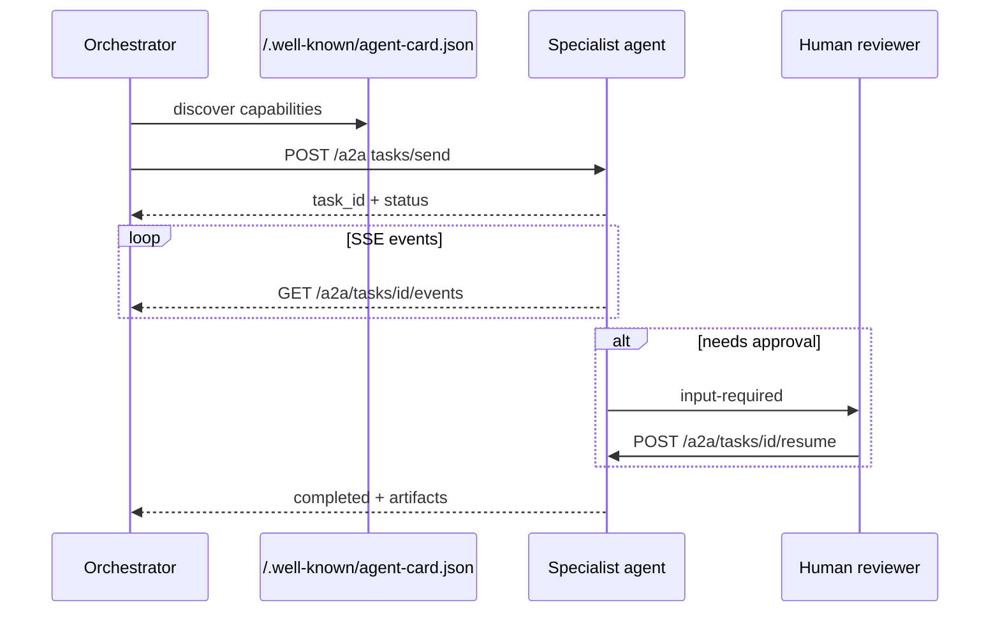

# A2A-style agent card (notes)

This repo ships `agent/card.json` as a **minimal agent discovery manifest** — analogous to
how MCP exposes tools, but for agent-to-agent routing in multi-agent systems.

## A2A task lifecycle

## Fields

- `name`, `description`, `capabilities` — what this agent can do
- `protocols` — `mcp` + `rest` in this sandbox
- `endpoints` — local service URLs

## Interview talking point

> "MCP standardizes tools for LLM clients; an agent card helps orchestrators pick the right
> specialist agent. Here the card lists integration skills; production would add auth, rate limits,
> and health checks."

## Not implemented (by design)

Full Google A2A protocol server, remote agent delegation, or cross-process agent mesh.
