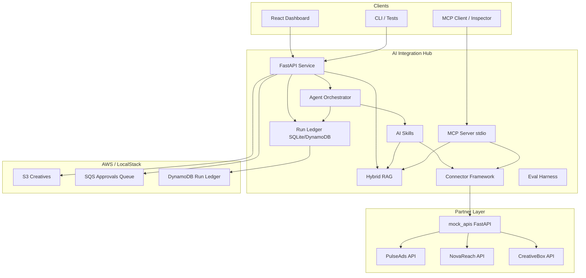
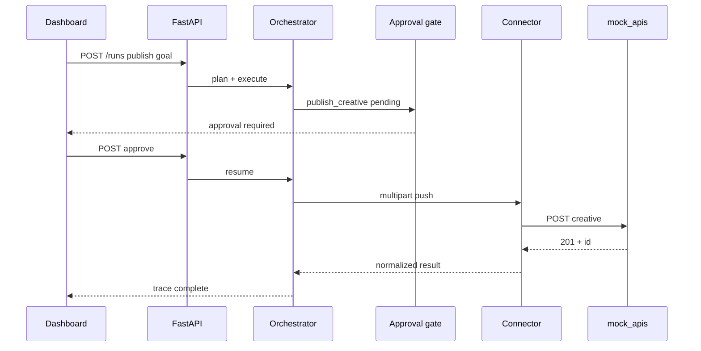
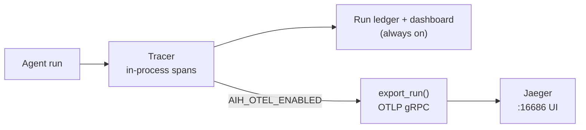

# Architecture — AI Integration Hub

## Context

An offline-first integration hub connecting internal automation to multiple partner ad networks,
with RAG-grounded docs, MCP tools, agent orchestration, human-in-the-loop approvals, evals, and a
monitoring dashboard.

## C4 Container diagram

## Key flows

1. **Read path:** Agent or dashboard triggers `sync_campaign_data` → connector GET with pagination →
   normalized records → optional LLM summary.
2. **Write path (HITL):** `publish_creative` → approval gate (API/CLI) → connector multipart PUSH →
   mock partner store / S3 archive.
3. **RAG path:** `POST /search` or `answer_from_docs` → hybrid BM25+dense fusion → cited chunks.
4. **Eval path:** `python tasks.py eval` → golden datasets → scorers → scorecard + regression thresholds.

## Publish flow (HITL write path)

## Deployment topology (docker-compose)

`docker compose up --build` boots the entire stack — service, partners, dashboard, AWS
emulation, and tracing — with no host dependencies beyond Docker.

| Service     | Port         | Role                                        |
|-------------|--------------|---------------------------------------------|
| service     | 8000         | FastAPI hub (OTLP export → jaeger)          |
| mock-apis   | 9000         | Offline partner API fakes                   |
| dashboard   | 5173 (→ 80)  | React/TS UI via nginx, proxies `/api`       |
| jaeger      | 16686 / 4317 | Trace UI + OTLP gRPC receiver               |
| localstack  | 4566         | S3, SQS, DynamoDB emulation                 |

The dashboard image is a multi-stage build (`deploy/dashboard.Dockerfile`): Vite builds the
static bundle, then nginx (`deploy/nginx.conf`) serves it and reverse-proxies `/api/*` to the
service (SSE-friendly: buffering off, long read timeout).

IaC: `deploy/template.yaml` (SAM/CloudFormation) mirrors LocalStack resources provisioned by
`deploy/provision_localstack.py`.

## Observability

Each agent run carries an in-process `Tracer` (`src/aih/observability/tracing.py`) that records
OpenTelemetry-shaped spans — `llm.tool_call` and `skill.run` per step — plus token/cost
estimates. These are persisted on the run trace (dashboard + SQLite ledger) with zero runtime
dependencies, so the offline-first default always works.

When `AIH_OTEL_ENABLED=true` (and the optional `otel` extra is installed), `export_run()` mirrors
those spans to an OTLP collector (Jaeger in compose) as a parent `run:<id>` span with one child per
step. The exporter is built lazily and fails closed to a silent no-op if OTel is disabled or its
packages are absent — observability never affects the success of a run.

## ADRs

- [001 — SQS for approvals](adr/001-sqs-approvals.md)
- [002 — S3 for creatives](adr/002-s3-creatives.md)
