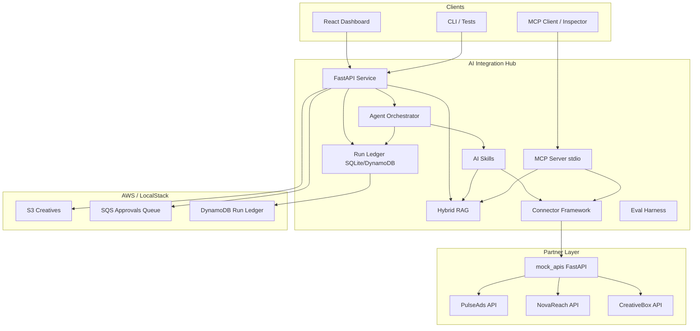
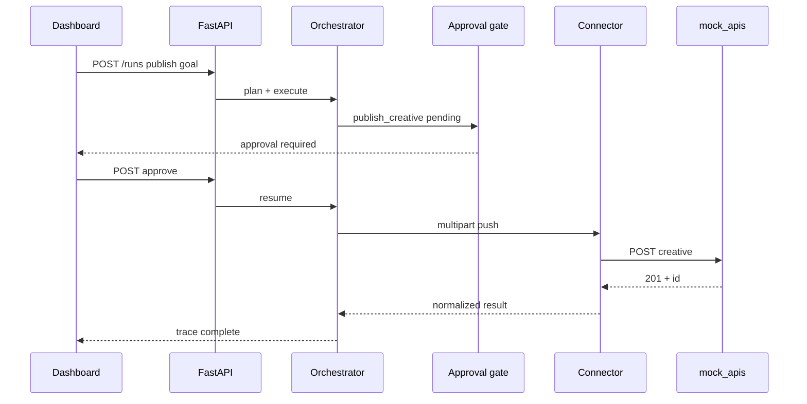

# Architecture — AI Integration Hub

## Context

An offline-first integration hub connecting internal automation to multiple partner ad networks,
with RAG-grounded docs, MCP tools, agent orchestration, human-in-the-loop approvals, evals, and a
monitoring dashboard.

## C4 Container diagram

## Key flows

1. **Read path:** Agent or dashboard triggers `sync_campaign_data` → connector GET with pagination →
   normalized records → optional LLM summary.
2. **Write path (HITL):** `publish_creative` → approval gate (API/CLI) → connector multipart PUSH →
   mock partner store / S3 archive.
3. **RAG path:** `POST /search` or `answer_from_docs` → hybrid BM25+dense fusion → cited chunks.
4. **Eval path:** `python tasks.py eval` → golden datasets → scorers → scorecard + regression thresholds.

## Publish flow (HITL write path)

## Deployment topology (docker-compose)

| Service     | Port | Role                          |
|-------------|------|-------------------------------|
| service     | 8000 | FastAPI hub                   |
| mock-apis   | 9000 | Offline partner API fakes     |
| localstack  | 4566 | S3, SQS, DynamoDB emulation   |

IaC: `deploy/template.yaml` (SAM/CloudFormation) mirrors LocalStack resources provisioned by
`deploy/provision_localstack.py`.

## ADRs

- [001 — SQS for approvals](adr/001-sqs-approvals.md)
- [002 — S3 for creatives](adr/002-s3-creatives.md)
