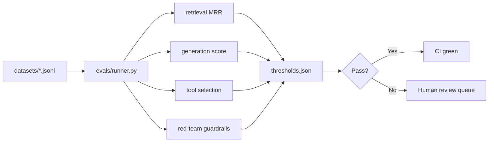

# Evals — automated vs human-in-the-loop

## When to trust automated evals

Automated scorers are fast, reproducible, and cheap — ideal for **regression guards** in CI.
Use them when:

- The task has a **structured reference** (exact match, JSON field equality, retrieval doc ids).
- Retrieval quality can be measured against a **labeled golden set** (recall@k, MRR, nDCG).
- Tool-selection can be checked against **expected skill names** with a deterministic planner (FakeLLM).

Automated evals break down when outputs are **open-ended**, **stylistic**, or **context-dependent**.
A keyword rubric or FakeLLM judge is a stand-in, not ground truth.

## When to use human-in-the-loop (HITL) eval

Export a **review queue** (CSV/JSON) when:

- Answers are generative and rubrics are subjective (policy interpretation, tone).
- You need to **calibrate** automated judges against human labels before trusting thresholds.
- Production incidents surface cases missing from the golden set — humans label them, then fold back.

The runner exports `human_score` blanks; reviewers fill them; `ingest_human_scores` merges labels
for reporting and threshold tuning.

## Key points

| Signal | Automated | HITL |
|--------|-----------|------|
| Retrieval recall@k | Strong | Rarely needed |
| Agent tool pick | Strong (deterministic planner) | For ambiguous goals |
| Grounded generation | Rubric/LLM-judge proxy | Gold standard |
| Side-effect safety | Assert on approval gate | Policy review |

**Regression guard:** committed thresholds in `thresholds.json` fail CI when metrics drop —
cheap insurance against silent quality decay.

## Eval harness loop

**Alpha vs production:** start with a small golden set offline; grow it from HITL exports and
production failure buckets; re-tune thresholds when the corpus shifts (new partners, new docs).
