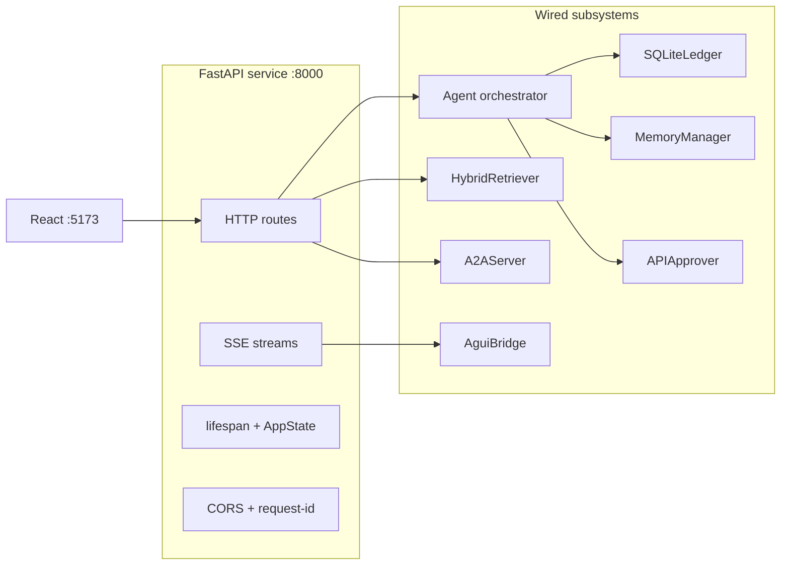
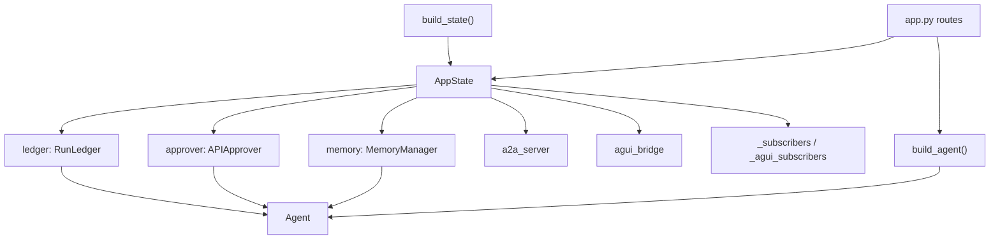
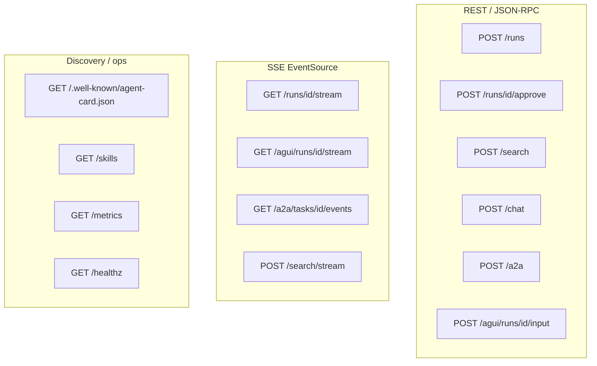
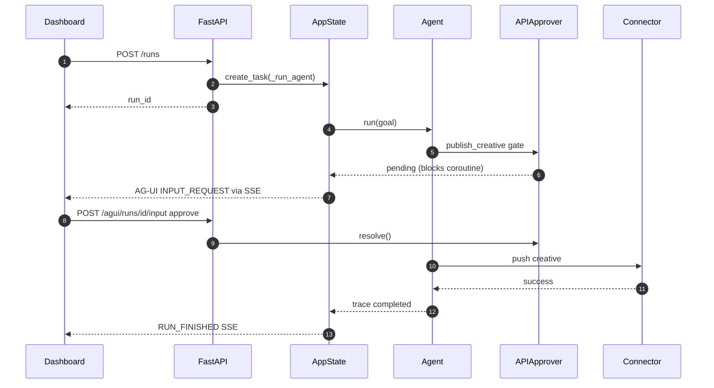
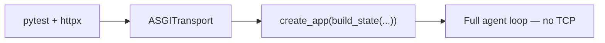

# FastAPI in the AI Integration Hub

## Why FastAPI here?

FastAPI is the **composition root** of the runnable sandbox: it wires the agent, RAG, connectors,
memory, protocol adapters (A2A, AG-UI), and observability into one async HTTP surface suitable for
the React dashboard, tests, and interview demos.

## Architecture role

## AppState dependency graph

## HTTP surface map

## Key modules

| Module | Role |
|---|---|
| `service/app.py` | Route definitions, SSE generators, JSON models |
| `service/deps.py` | `AppState` — shared ledger, approver, memory, subscribers |
| `service/chat.py` | Multi-turn RAG chat (separate from agent loop) |
| `service/webhooks.py` | Partner callback intake |

## Publish creative — sequence

## How we use it in the AI application

### 1. Dependency injection via `AppState`

`build_state()` constructs a single `AppState` attached to `app.state.aih` at startup. Routes never
instantiate agents directly — they call `app_state.build_agent()`, `build_retriever()`, etc.
This keeps tests able to inject `InMemoryLedger`, `APIApprover`, and mock HTTP transports.

### 2. Background agent runs

`POST /runs` spawns `asyncio.create_task(_run_agent(...))` so the HTTP request returns immediately
with a `run_id`. The ledger's `save()` is monkey-patched to `notify()` subscribers — powering both
legacy `/runs/{id}/stream` and AG-UI `/agui/runs/{id}/stream`.

### 3. Human-in-the-loop over HTTP

`APIApprover` blocks the agent coroutine on side-effecting skills. `POST /runs/{id}/approve` (or
`POST /agui/runs/{id}/input`) calls `resolve()`, unblocking the agent. Same gate drives A2A
`input-required`.

### 4. SSE for live UX

- `/runs/{id}/stream` — trace JSON updates (dashboard legacy path)
- `/agui/runs/{id}/stream` — typed AG-UI events + A2UI payloads
- `/search/stream` — RAG token streaming
- `/a2a/tasks/{id}/events` — A2A task lifecycle

`sse-starlette` `EventSourceResponse` keeps connections ordered and ping-alive.

### 5. Offline-first testing

Integration tests use `httpx.ASGITransport(app=create_app(build_state(...)))` — no TCP, no keys.
The same app factory powers local dev, CI, and interview-room demos.

## Interview talking points

- **Async all the way:** agent, connectors, RAG search are `async`; FastAPI matches without thread pools.
- **Thin routes, fat domain:** routes validate I/O; orchestration lives in `agent/`, `memory/`, `a2a/`.
- **One process, many protocols:** REST for CRUD, SSE for streams, JSON-RPC for A2A — same `AppState`.
- **12-factor config:** `AIH_*` env vars via `pydantic-settings`; no secrets in code.
