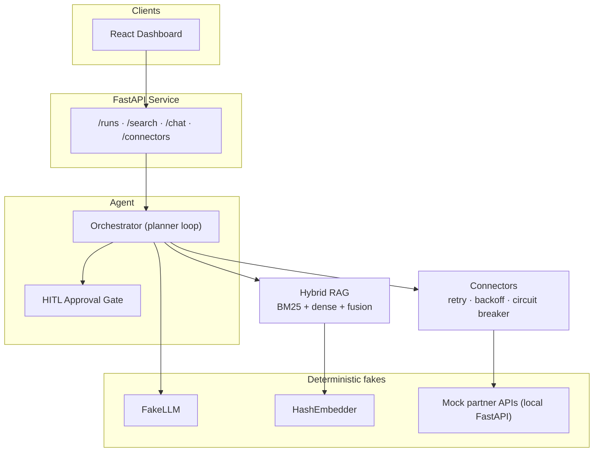
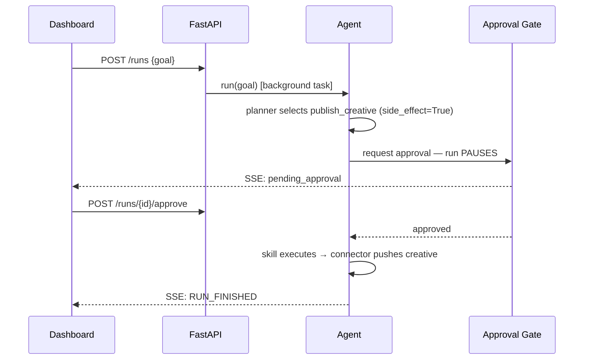
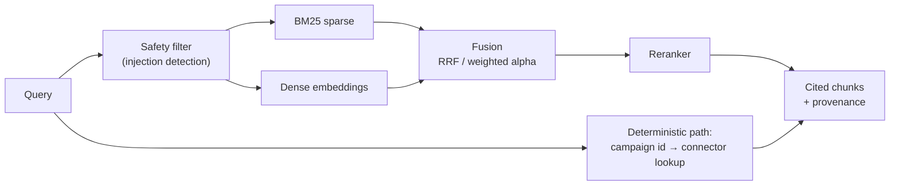

<!--
  HOW TO PUBLISH THIS ON MEDIUM
  ─────────────────────────────
  1. Medium does not render Mermaid. For each ```mermaid block below:
     open https://mermaid.live, paste the diagram source, and export as PNG
     (use the dark theme to match the screenshots). Insert the PNG at that spot.
  2. Paste the rest as Markdown (Medium's editor imports it cleanly via
     "Story > Import a story", or paste section by section).
  3. Add a cover image: a screenshot of the dashboard with a run paused at
     the approval gate is the strongest option.
  4. Replace REPO_URL if you rename the repository.
-->

# Building an AI Agent You Can Test in CI — With Zero API Keys

*Every AI tutorial starts with "first, get your API key." This one doesn't.*

---

I kept running into the same wall while building AI-powered integrations: **you can't write a reliable test suite on top of a non-deterministic, metered API.**

Unit tests that call a real LLM are slow, cost money on every CI run, flake when the provider has a bad day, and — worst of all — return *different output for the same input*. So most agent projects I've seen either skip testing entirely or mock so aggressively that the tests verify nothing.

I wanted to know what it would take to build a *complete* agentic system — planner loop, tool calling, RAG, human-in-the-loop approvals, evals — that runs **fully offline, deterministically, with zero accounts or API keys**, and where `pytest` in CI actually exercises the whole stack.

The result is the [AI Integration Sandbox](https://github.com/madosh/ai-integration-sandbox) (MIT licensed). This article covers the three design decisions that made it work, because I think they generalize to any serious AI system:

1. **Deterministic fakes at every external boundary**
2. **A human-in-the-loop gate that is structural, not optional**
3. **Evals as CI gates, not dashboards**

## The architecture in one picture

The system simulates an AI-native integration hub: an agent that syncs campaign data from fake ad-network partners, publishes creatives (with human approval), and answers questions grounded in a document corpus via hybrid RAG.



Every box on the right side — the LLM, the embeddings, the partner APIs — is a **local, deterministic implementation** behind the same interface a real provider would use. That's the whole trick, and it's less limiting than it sounds.

## Decision 1: Deterministic fakes at every external boundary

The `FakeLLM` is not a mock that returns `"mocked response"`. It's a small rule-based engine that does two things well enough to drive a real agent loop:

- `complete()` extracts the most relevant sentence from any `CONTEXT:` block in the prompt — so RAG-grounded answers are real answers, derived from actually-retrieved chunks.
- `tool_call()` selects a tool by matching the user's goal against tool names and descriptions, and fabricates schema-valid arguments from each tool's JSON schema.

```python
class FakeLLM:
    """A deterministic stand-in for a real LLM.

    - `complete` echoes a compact, rule-based summary of the prompt.
    - `tool_call` selects a tool by keyword-matching the latest user
      message against tool names/descriptions, and fabricates plausible,
      schema-shaped arguments. This is enough to drive the agent loop.
    """
```

The same idea applies to embeddings (`HashEmbedder`: a deterministic hashed bag-of-words — no model download, same vector for the same text, every time) and to the partner APIs (three local FastAPI apps that deliberately differ: one uses Bearer tokens with cursor pagination and 429 rate limits, one uses API keys with offset pagination, one uses Basic auth with multipart uploads — so the connector abstraction has to earn its keep).

**Why this matters:** because everything is deterministic, the test suite can make *strong* assertions. Not "the agent returned something" but "given this goal, the planner selects `publish_creative`, the approval gate fires, and after approval the connector pushes exactly this payload." 78 test functions run in CI on every push, offline, in seconds.

Swapping in a real provider is an environment variable (`AIH_LLM_PROVIDER=anthropic`), because everything codes against an `LLMClient` protocol, not a vendor SDK. The fakes aren't a compromise — they're the test harness the real system runs inside.

## Decision 2: Make the human-in-the-loop gate structural

Most "human in the loop" implementations are a `print()` and an `input()`. The interesting problems only show up when the approval is *asynchronous* — the agent is paused mid-run on a server while a human decides in a browser.

In the sandbox, every skill declares `side_effect: bool`. The orchestrator refuses to execute a side-effecting skill without a decision from an injected `Approver`:

```python
if skill.side_effect:
    proceed = await self._gate(trace, skill.name, call.arguments)
    if not proceed:
        messages.append(
            ChatMessage(role="assistant", content=f"{skill.name} denied; skipped.")
        )
        continue
```

The gate parks the run on an `asyncio.Future` that only resolves when a human hits Approve or Deny in the dashboard (or a timeout auto-denies it). The run trace, streamed over Server-Sent Events, shows the pause in real time:



Three details I'd insist on in any production version, all present here:

- **The gate is enforced by the orchestrator, not the skill.** A skill can't forget to ask.
- **Denial is a first-class outcome.** A denied run ends with status `denied` and zero side effects — asserted in tests.
- **Approvals time out.** A pending approval auto-denies after a configurable window instead of parking a coroutine forever.

Because the whole flow is deterministic, *the approval pause itself is unit-tested* — something I've never been able to do against a live LLM.

## Decision 3: Evals are CI gates, not dashboards

Retrieval and generation quality are measured by an eval harness with **committed thresholds**. This file lives in the repo:

```json
{
  "retrieval.recall_at_3": 0.75,
  "retrieval.mrr": 0.75,
  "retrieval.ndcg_at_3": 0.75,
  "generation.llm_judge": 0.5,
  "tool_selection.accuracy": 0.66,
  "redteam.block_rate": 0.5,
  "rerank.quality": 0.5
}
```

The runner executes every suite — retrieval (recall@k, MRR, nDCG), generation (LLM-as-judge), tool selection accuracy, and a red-team suite probing prompt injection — prints a scorecard, writes a timestamped report, and **exits non-zero if any metric drops below its threshold**. CI runs it after the test suite.

That last property changes behavior. If I "improve" the chunking strategy and recall@3 falls from 0.80 to 0.70, the build breaks. Quality regressions get caught in code review like any other bug, instead of being discovered in a dashboard three weeks later. Determinism is what makes this honest: the score can't fluctuate, so a red build always means *my change* did it.

The RAG pipeline being evaluated is a real hybrid setup, not a toy:



One framing from this pipeline that I now use everywhere: **retrieve prose, look up facts.** Text retrieval is probabilistic — right for policies and documentation. But when a query references a structured entity (a campaign ID, a price, a status), the retriever fetches the authoritative record from the source system and returns it *labelled with its provenance* (`connector:pulseads` vs `doc:faq-3`), so the downstream answer is auditable.

## What this deliberately doesn't do

Honesty section. The FakeLLM is not intelligent — it keyword-matches. It cannot handle novel goals, multi-step reasoning it wasn't shaped for, or ambiguity. This sandbox teaches and tests *architecture*: the gates, retries, budgets, traces, and evals that surround the model. The model itself is swappable precisely because everything else doesn't depend on its cleverness.

If your takeaway is "fakes can replace real model testing," that's the wrong lesson. You still need eval runs against real models before shipping. The right lesson is that **the deterministic layer is where 90% of your bugs live** — the pagination bug, the missing retry on 429, the approval race, the unbounded chat history — and none of those need a $0.01-per-assertion API call to catch.

## Try it

```bash
git clone https://github.com/madosh/ai-integration-sandbox
cd ai-integration-sandbox
python tasks.py setup && python tasks.py test   # offline, deterministic
docker compose up                               # full stack: API + dashboard + mock partners
```

Start a run in the dashboard with the goal *"publish the new creative to creativebox"*, watch the planner select the skill, and watch the run pause at the approval gate waiting for your click. That pause — a coroutine parked on a Future while a human decides — is my favorite part of the whole system.

The repo is MIT licensed. Specs for every module live in `specs/` (each feature was spec'd before it was built), and the eval datasets, thresholds, and mock partners are all in the tree. Break it, extend it, or steal the patterns.

---

*If this was useful, the repo has deeper dives waiting: a connector framework with circuit breakers and keyset pagination, an A2A (agent-to-agent) JSON-RPC surface, seven memory types, and an MCP server exposing the same skills to any MCP client. Each one is a future article — tell me in the comments which you'd read first.*
