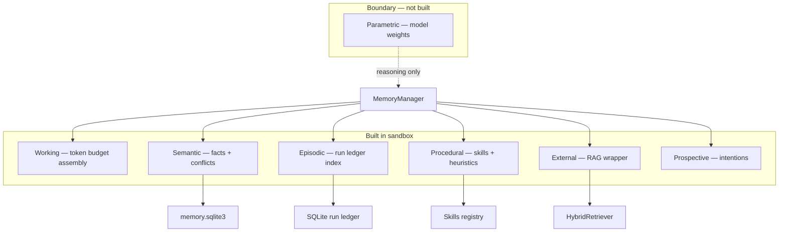
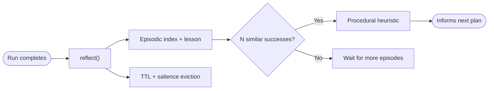
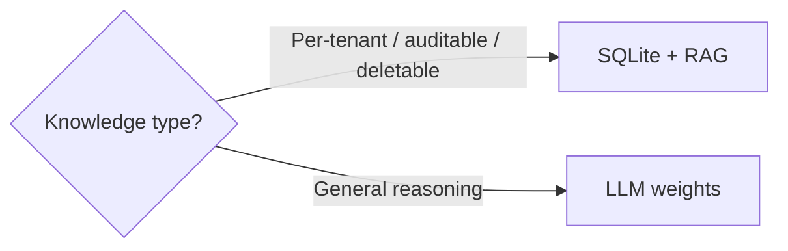
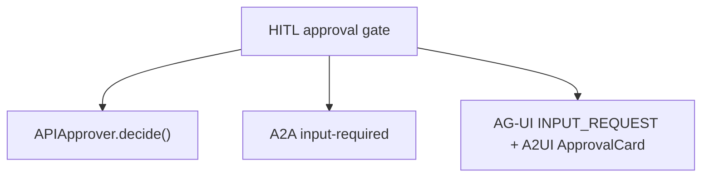

# Agent memory — interview notes

## Memory taxonomy map

## Seven memory types (built vs boundary)

| Type | Built? | Where | Interview one-liner |
|---|---|---|---|
| Working / in-context | Yes | `memory/working.py` | Token-budgeted context assembly with provenance |
| Semantic | Yes | `memory/semantic.py` | Facts/preferences with conflict flags |
| Episodic | Yes | `memory/episodic.py` + run ledger | "Have we tried this goal before?" |
| Procedural | Yes | `memory/procedural.py` + skills registry | Declared skills + learned heuristics |
| External / retrieval | Yes | `memory/external.py` → `rag/` | Same embedder as semantic — one vector layer |
| Parametric | **Boundary** | model weights | General reasoning stays in the LLM |
| Prospective | Yes | `memory/prospective.py` | Scheduled intentions surface at agent tick |

## Consolidation loop

## Externalize vs keep parametric

| Factor | Externalize (RAG / memory store) | Keep parametric (weights) |
|---|---|---|
| Cost | Extra retrieval latency per turn | Amortized at inference |
| Auditability | High — cite sources, inspect rows | Low — opaque |
| Deletability (GDPR) | `delete_subject()` erases rows | Cannot delete one user's facts from weights |
| Staleness | Refresh facts without retraining | Needs fine-tune / RLHF to update |
| Per-tenant data | Natural fit | Risk of cross-tenant leakage |

**Senior signal:** name parametric as the boundary — don't fake it in a sandbox.

## Consolidation and forgetting

- **After each run:** `reflect()` writes episodic index + optional semantic fact.
- **Periodic:** `consolidate()` distills N successful episodes → procedural heuristic (FakeLLM-deterministic).
- **Forgetting:** TTL + salience eviction on stale low-salience semantic facts.

## One mechanism, three protocol faces

The **HITL approval gate** you already built is the same pause expressed as:

- In-process: `APIApprover` blocking `decide()`
- A2A: task state `input-required`
- AG-UI: `INPUT_REQUEST` event + A2UI `ApprovalCard`

Leading with that unification shows architectural taste.
