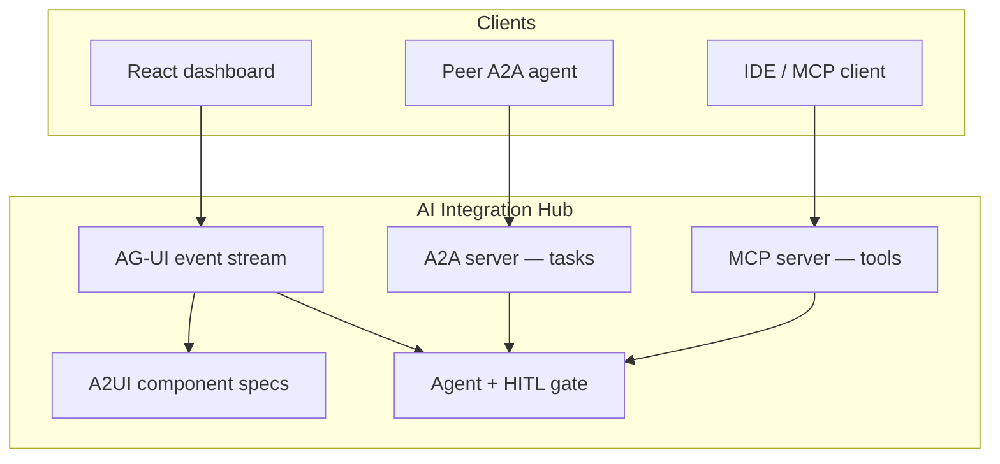
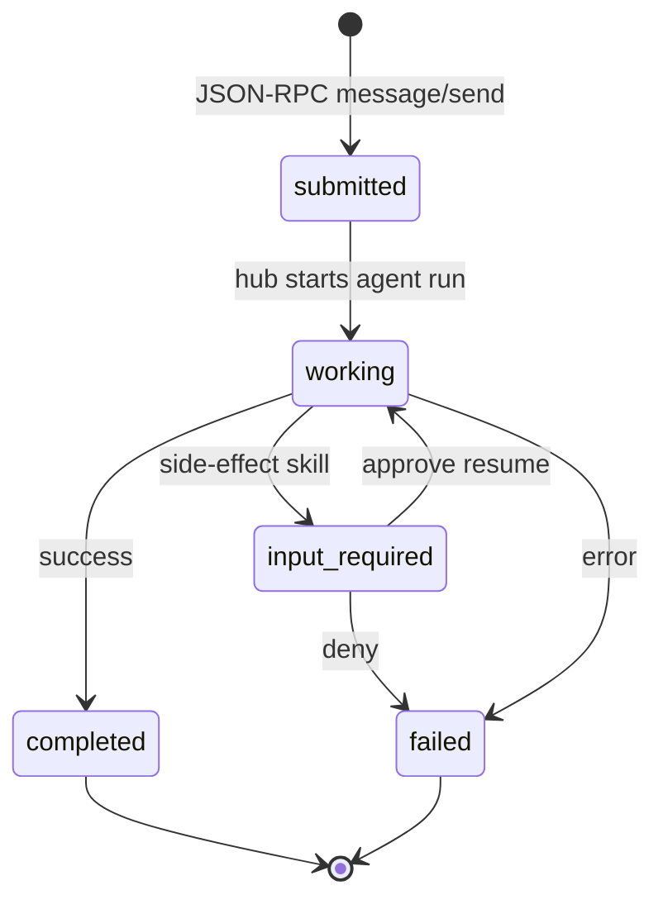
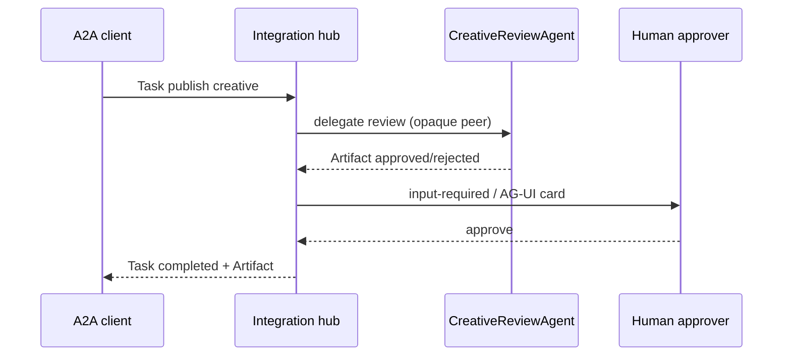
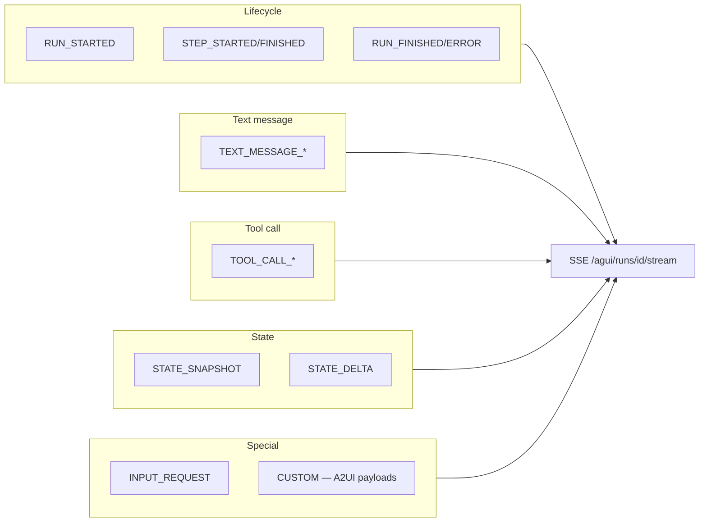
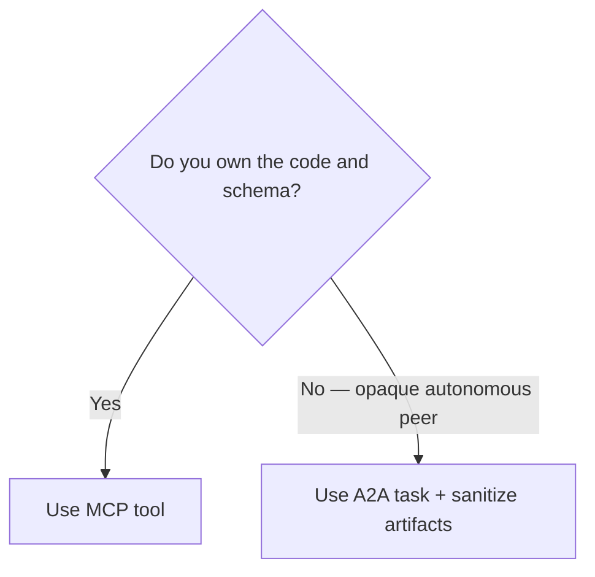

# Communication protocols — MCP, A2A, AG-UI / A2UI

## Three-legged stool

## A2A task lifecycle

## A2A publish flow (with peer review)

## AG-UI event categories

## When to use which

| Protocol | Exposes | Best for | This repo |
|---|---|---|---|
| **MCP** | Typed tools (connectors, RAG) | IDE agents, fully controlled capabilities | `mcp_server/` |
| **A2A** | Whole agent + task lifecycle | Opaque / third-party / autonomous peers | `a2a/` + Agent Card |
| **AG-UI** | Event stream + lifecycle | Standardized agent→UI transport | `agui/events.py` |
| **A2UI** | Declarative UI payloads | Generative UI without React edits | `agui/a2ui.py` |

## A2A vs MCP tool — when to reach for A2A?

Use **MCP** when you own the code, schema, and execution environment (call a tool directly).

Use **A2A** when the counterparty is an **opaque, autonomous agent** (different codebase, vendor, policy engine) that negotiates a **task** and returns **artifacts** you must sanitize.

## Opaque-agent principle

Peer agents are **untrusted**. Treat returned text as **data**, not instructions. Sanitize artifacts; watch for cross-agent prompt injection.

## HITL unification

| Layer | Expression |
|---|---|
| Agent | `approval.py` gate |
| A2A | `input-required` task state |
| AG-UI | `INPUT_REQUEST` + A2UI `ApprovalCard` |

## Version honesty

- **A2A:** target v0.2.x (JSON-RPC + SSE + Agent Card at `/.well-known/agent-card.json`)
- **AG-UI:** ~16–17 event types — pin shapes in `specs/agui.md`; spec still moving
- **A2UI:** youngest / least settled — illustrative field names only

Verify canonical specs before interviews: [a2a-protocol.org](https://a2a-protocol.org), [docs.ag-ui.com](https://docs.ag-ui.com).
