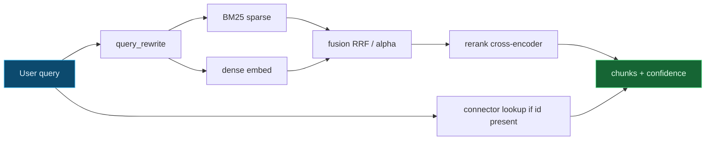

# RAG notes: dense vs sparse vs fusion (interview talking points)

A one-page mental model for hybrid retrieval, grounded in this repo's `aih.rag` module.

## Hybrid retrieval pipeline

## Sparse (BM25)

- **What it is:** a probabilistic bag-of-words scorer. Score per document rises with term frequency
  (saturating), falls with document length, and is weighted by **IDF** so rare terms count more.
- **Strengths:** exact keyword / identifier match, rare-term precision (error codes, SKUs, `429`),
  zero training, fully interpretable, cheap. Strong out-of-the-box baseline.
- **Weaknesses:** no semantics — "car" and "automobile" are unrelated; vocabulary mismatch hurts;
  sensitive to tokenization.

## Dense (embeddings + cosine)

- **What it is:** map text to a vector; score by cosine similarity. Captures **semantic** similarity
  (paraphrases, synonyms) when a real model is used.
- **Strengths:** robust to vocabulary mismatch; good recall on conceptual queries.
- **Weaknesses:** can miss exact rare tokens; needs an embedding model; less interpretable; quality
  is model-dependent. (In this offline sandbox the default `HashEmbedder` is a deterministic hashed
  bag-of-words — it has *no* IDF, which is exactly the lever the tests exploit to make BM25 and dense
  disagree.)

## Fusion: alpha vs RRF

We combine the two rankings two ways (`aih.rag.fusion`):

- **Weighted alpha fusion** — `fused = alpha * dense_norm + (1 - alpha) * sparse_norm` over
  min-max-normalized scores. Blends score *magnitudes*. Best when both signals are well-calibrated
  and you want a tunable dial. Downside: needs normalization and is sensitive to score distributions.
- **Reciprocal Rank Fusion (RRF)** — `score = sum 1 / (k + rank)` over each ranking. Blends *ranks*,
  ignoring magnitudes. Robust when the two scores live on incomparable scales (BM25 vs cosine, the
  usual case) and needs no calibration. The standard, hard-to-beat default.

### When does each win?

- Use **RRF** by default: it is scale-free and robust. It shines when one retriever is noisy on
  magnitude but its *ordering* is still informative.
- Use **alpha** when you have calibrated, comparable scores and want explicit control over the
  dense/sparse trade-off (e.g. to lean lexical for an identifier-heavy domain).
- At the extremes the dial degenerates cleanly: `alpha=0` is pure BM25, `alpha=1` is pure dense
  (asserted in `tests/rag`).

## Probabilistic vs deterministic

Text retrieval is **probabilistic** — it returns the *likely* relevant passages. For structured
facts (a specific campaign id, a price, a status), prefer a **deterministic** path: look the record
up in the authoritative system (a connector) and return it labelled `connector:<partner>` instead of
a retrieved paragraph. `HybridRetriever` does both: if a query references a campaign id it attaches
the authoritative record alongside the retrieved text, each carrying explicit **provenance** so the
downstream answer is auditable. Rule of thumb: retrieve prose, look up facts.
